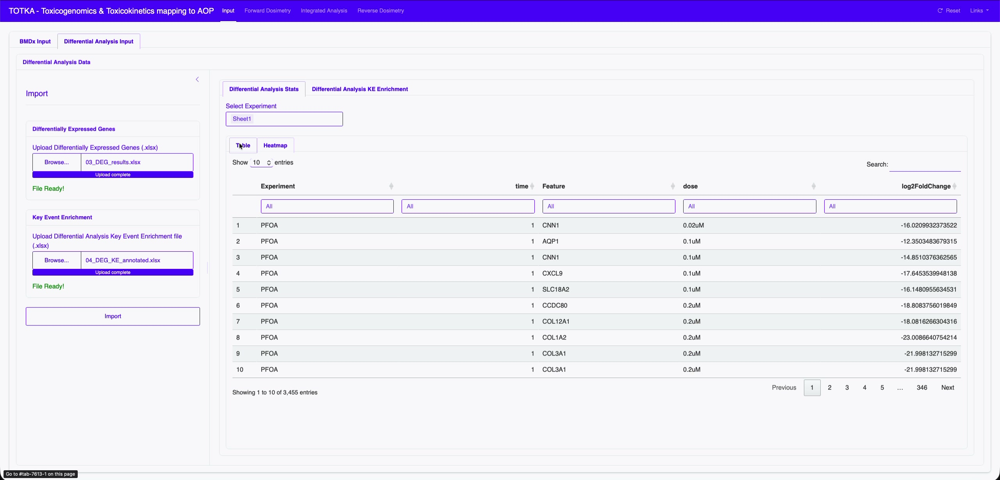
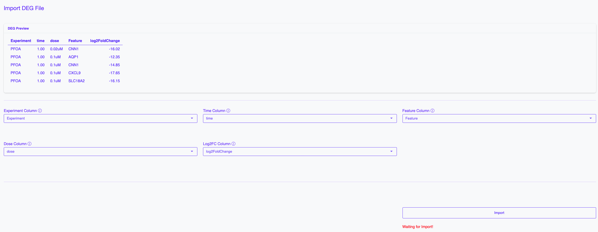
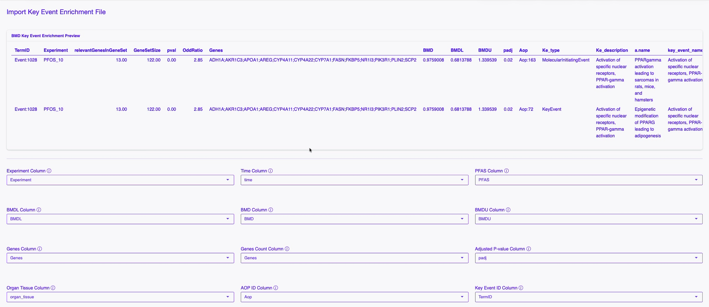
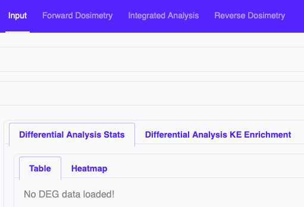
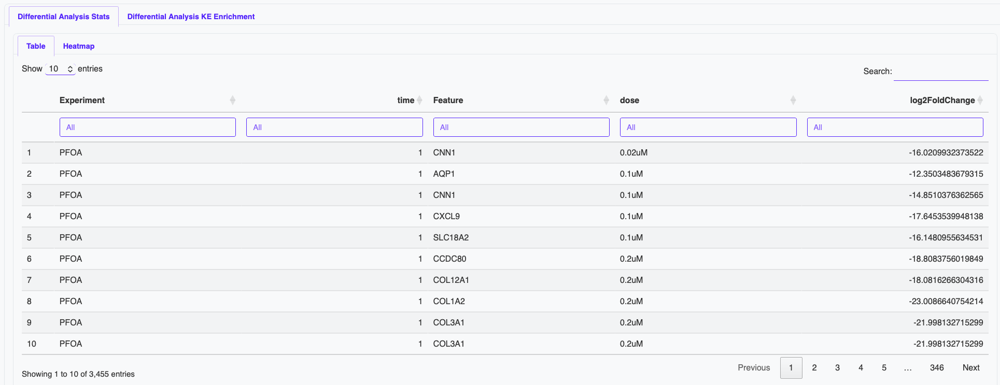
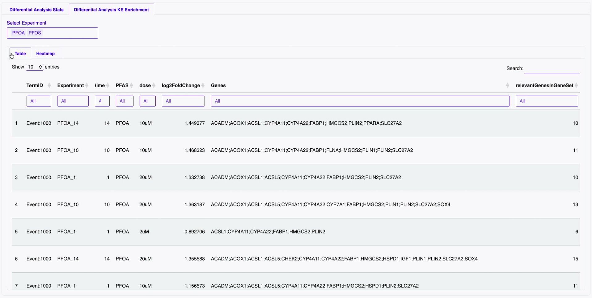
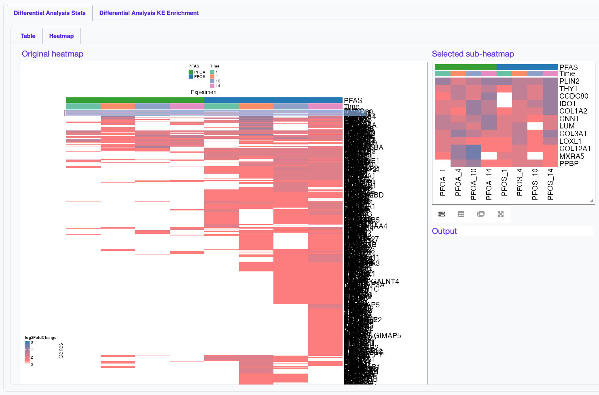

# Differential Analysis Input

## Differential Analysis Results Import Panel

Within the *Differential Analysis Input* tab, the following components are visible:

### 1. Differentially Expressed Genes

- Button: **Browse...** to select an Excel file  
- Expected input: gene-level Differential Expression analysis results  
- Message:  
  - “No file selected” → no file loaded  
  - “Waiting for Import!” → file selected but not yet confirmed  
  - “File Ready!” → file successfully processed  

---

### Step-by-step upload workflow

The upload of the Differential Expressed Genes file is performed through three main stages:

---

#### Step 1 — File selection and preview

After selecting a file using the **Browse...** button, the application displays a preview of the dataset.

The preview table (**“Differential Analysis Results Preview”**) shows the structure of the uploaded data, including:

- **Experiment**: chemical or condition (e.g., PFOS)  
- **time**: exposure time point  
- **Dose**: dosage information  
- **Feature**: gene identifier  
- **log2FoldChange**: log2 fold change for differential analysis  

This preview step is critical to:
- Verify that the correct file has been loaded  
- Ensure column names are recognized  
- Inspect the quality and structure of the data  

---

#### Step 2 — Column mapping

After previewing the data, the user must define how the columns in the uploaded file correspond to the expected variables used by the application.

The following mappings are required:

- **Experiment Column** → identifies experimental conditions  
- **Time Column** → identifies exposure duration  
- **Feature Column** → gene identifier  
- **Dose Column** → dosage information  
- **Log2FC Column** →  log2 fold change for differential analysis  

Each field is selected through a dropdown menu populated with the column names detected in the uploaded file.

This step ensures compatibility between user-provided data and the internal analysis pipeline.

---

#### Step 3 — Import validation

Once all columns are correctly mapped:

- Click the **Import** button  
- The application validates the dataset  
- The import status is updated:

  - **“Waiting for Import!”** (red) → mapping completed but import not confirmed  
  - **“File Ready!”** (green) → data successfully loaded  

### 2. Key Event Enrichment

- Button: **Browse...**
- Expected input: KE enrichment annotated with AOP information
- Message:  
  - “No file selected” → no file loaded  
  - “Waiting for Import!” → file selected but not yet confirmed  
  - “File Ready!” → file successfully processed  

---

### Step-by-step upload workflow

The upload of the Differential Analysis Genes Key Event enrichment file is performed through three main stages:

---

#### Step 1 — File selection and preview

After selecting a file using the **Browse...** button, the application displays a preview of the dataset.

The preview table (**“DEG KE Preview”**) shows the structure of the uploaded data, including:

- **TermID**: Key Event ID (e.g., Event:105)  
- **Experiment**: chemical or condition and time information (e.g., PFOS_10)  
- **relevantGenesInGeneSet**: Number of genes in the enriched Key Event  
- **GeneSetSize**: Number of total genes in the gene set
- **pval**: P-value of the Key Event enrichment
- **Genes**: Genes (Feature IDs) in the Key Event enrichment
- **log2FoldChange**: log2 fold change for differential analysis  
- **padj**: Adjusted P-value of the Key Event enrichment
- **Aop**: Adverse Outcome Pathway ID (e.g., Aop:437)  
- **Ke_type**: Key Event type (MolecularIniitatingEvent, KeyEvent)  
- **Ke_description**: Description for Key Event
- **a.name**: Adverse Output Pathway name
- **key_event_name**: Key Event name
- **level**: Key Event level
- **organ_tissue**: Key Event associated organ/tissue
- **Timepoint**: exposure time point  

This preview step is critical to:
- Verify that the correct file has been loaded  
- Ensure column names are recognized  
- Inspect the quality and structure of the data  

---

#### Step 2 — Column mapping

After previewing the data, the user must define how the columns in the uploaded file correspond to the expected variables used by the application.

The following mappings are required:

- **Experiment Column** → identifies experimental conditions  
- **Time Column** → identifies exposure duration  
- **PFAS Column** → PFAS checmial information
- **Dose Column** → dose information
- **Genes Column** → gene identifier  
- **Genes Count Column** → number of genes  
- **Log2FC Column** →  log2 fold change for differential analysis  
- **Adjusted P-value Column** → adjusted p-value 
- **Organ Tissue Column** → organ/tissue information for key event 
- **AOP ID Column** → adverse outcome pathway identifier 
- **Key Event ID Column** → key event identifier 
- **Key Event Name Column** → key event name
- **Key Event Description Column** → key event description
- **Key Event Type Column** → key event type
- **Key Event Level Column** → key event level

Each field is selected through a dropdown menu populated with the column names detected in the uploaded file.

This step ensures compatibility between user-provided data and the internal analysis pipeline.

---

#### Step 3 — Import validation

Once all columns are correctly mapped:

- Click the **Import** button  
- The application validates the dataset  
- The import status is updated:

  - **“Waiting for Import!”** (red) → mapping completed but import not confirmed  
  - **“File Ready!”** (green) → data successfully loaded  

### 3. Import Button

- The **Import** button initiates data loading
- Both files must be provided before proceeding
- After import, the data become available for visualization and analysis

---

## Right Panel: Data Visualization

The right-hand side displays **preview and visualization of the loaded data**.

At the initial stage (before import), a message indicates:

- “No DEG data loaded!”

Once data are imported, this panel enables:

### Tabs

- **Differential Analysis Stats**
  - Table of gene-level DEF results
  - Includes sorting, filtering, and search functionality

- **Differential Analysis KE Enrichment**
  - KE-level enrichment results linked to AOP annotations

### Visualization Modes

Within each tab, different views are available:

- **Table view**
  - Interactive, filterable tables

- **Heatmap view**
  - Visual representation of gene or KE responses across:
    - Chemicals (e.g., PFOS, PFOA)
    - Time points
    - Experiments

---

## Workflow Interpretation

The Home page reflects the first stage of the TOTKA workflow:

1. Upload input datasets (BMD, KE enrichment, optional DEG)
2. Verify data through preview tables and visualizations
3. Prepare inputs for downstream analysis modules

Only after successful import can the user proceed to:

- Forward dosimetry simulations  
- Integrated KE activation analysis  
- Reverse dosimetry  

---

## Key Concept

The separation between:

- **Left panel → Input configuration**
- **Right panel → Data visualization**

ensures a clear workflow where users can:
- Validate their data before analysis
- Explore datasets interactively
- Maintain consistency between inputs and outputs across modules

