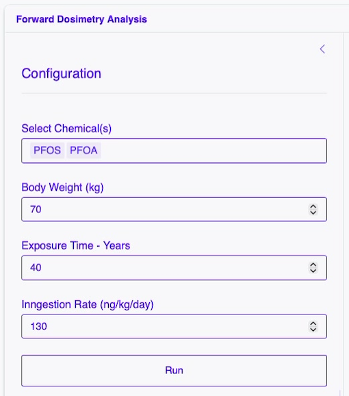
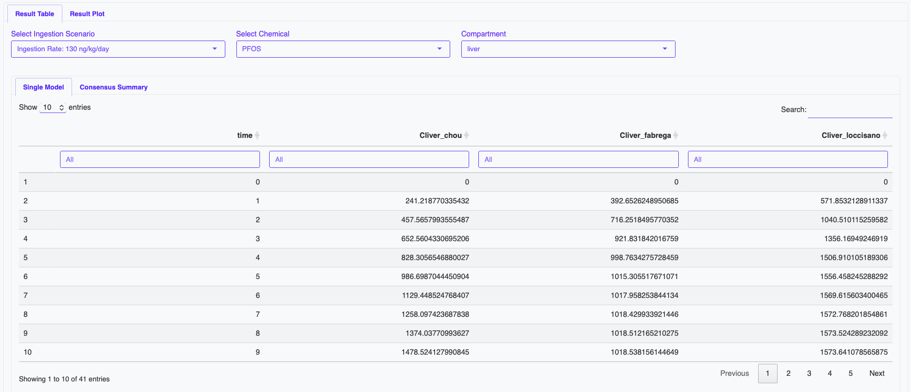
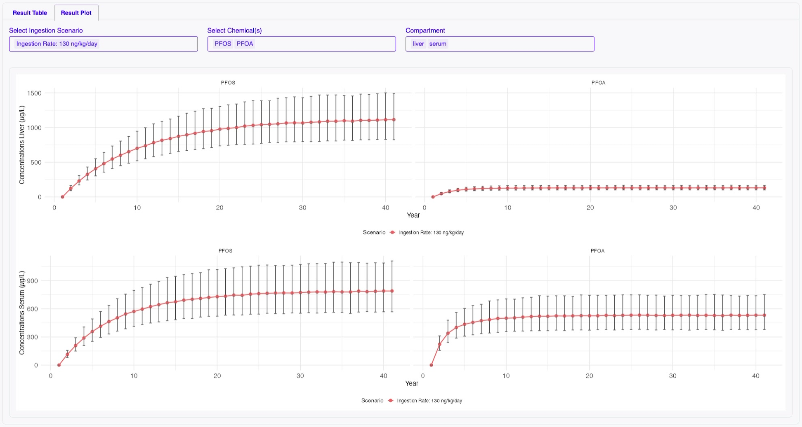
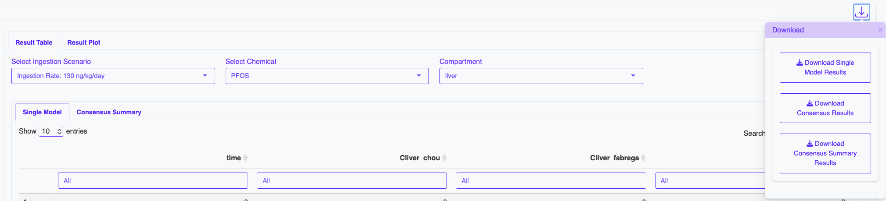

# Forward Dosimetry

PfasDosim R package is used to simulates chemical accumulation.

## Left Panel: Foward Dosimetry Simulation Configuration

The left-hand side of the interface is dedicated to **configuration and running**.

### Parameters
- **Chemical** : chemical (PFOS, PFOA)
- **Body Weight (kg)** : body weight in kilograms
- **Exposure Time - Years** : Exposure time in years
- **Ingestion Rate (ng/kg/day)** : Ingestion rate in nanogram of chemical per kilogram of body weight per day

## Right Panel: Foward Dosimetry Simulation Results

### Output Tabs

- Time-series tables

- Concentration plots

- Selectable:
  - Chemical (PFOS, PFOA)
  - Compartment (liver, serum)

### Download Results

- Single Model Results Table : Simulation results for each individual model
- Consensus Results Table : Consensus simulation results from all models
- Consensus Summary Results Table : Consensus simulation results with summarized values

