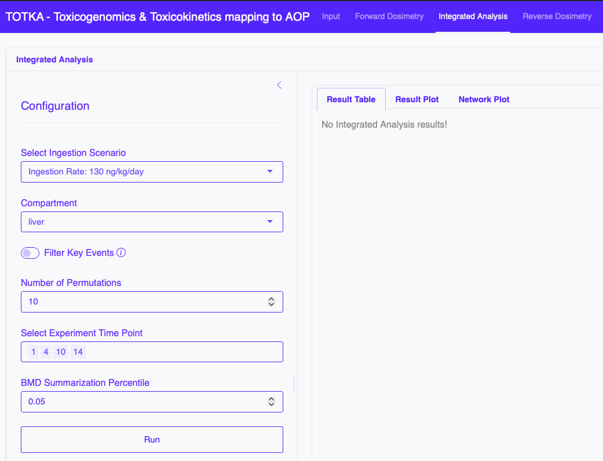
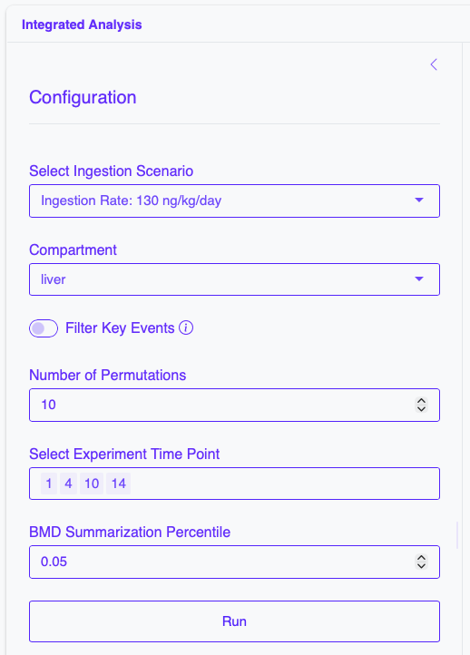
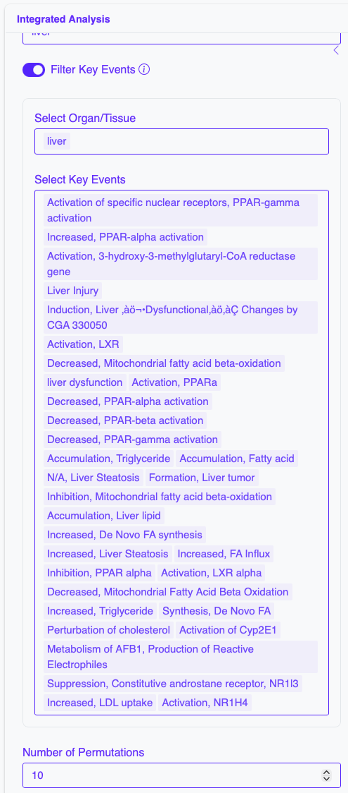
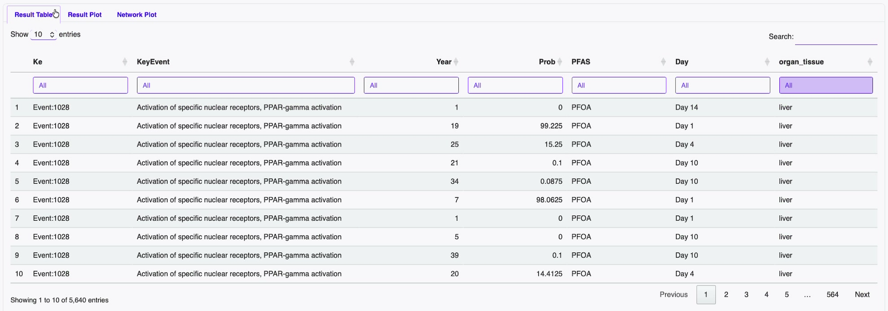
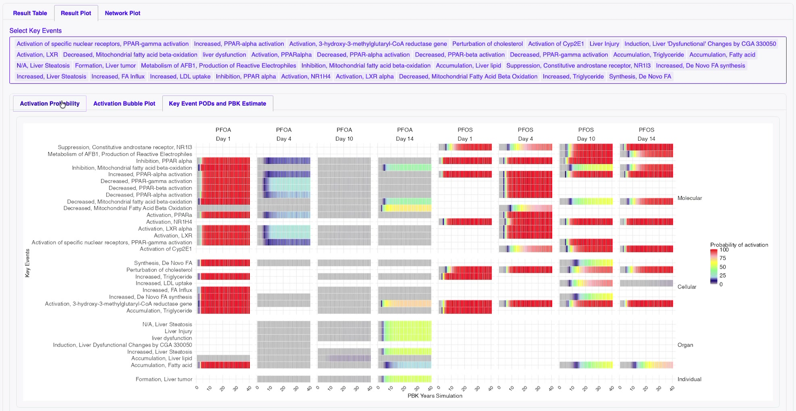
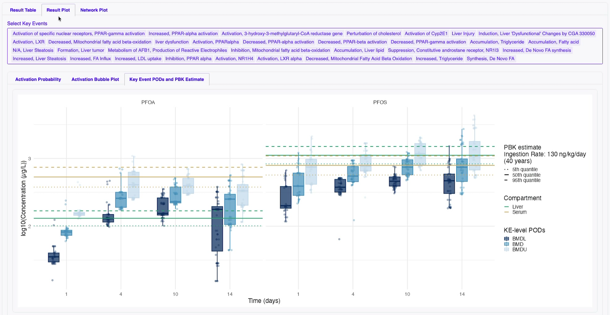
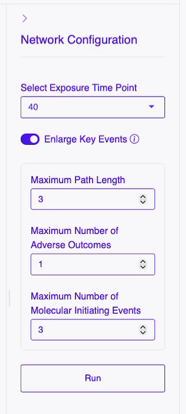
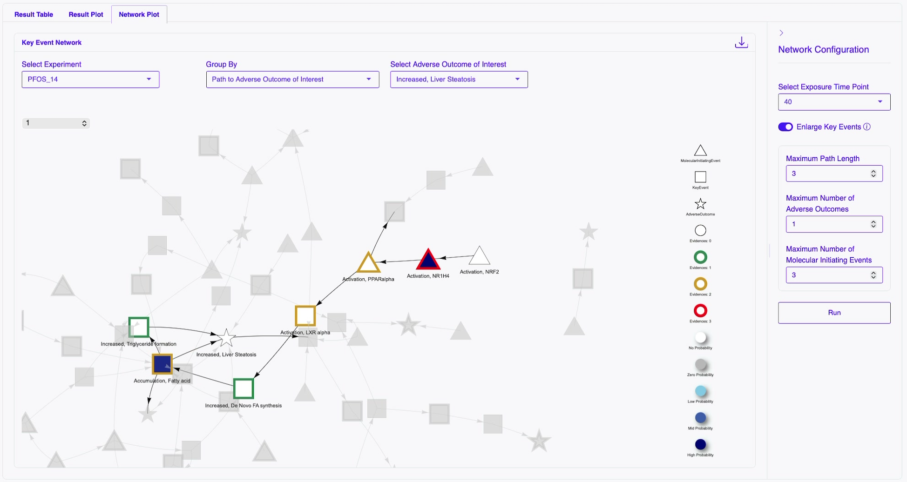

# Integrated Analysis

Combined evaluation of toxicogenomics and dosimetry results.

## Left Panel: Integrated Analysis Configuration

The left-hand side of the interface is dedicated to **configuration and running**.

### Parameters
- **Select Ingestion scenario** : Ingestion scenario configured during Forward Dosimetry analysis
- **Compartment** : Compartments simuated during Forward Dosimetry analysis (PFOS, PFOA)
- **Number of Permutations** : Number of permutations for the integrated analysis
- **Select Experiment Time Point** : Time point information uploaded in the BMD results input
- **BMD Summarization Percentile** : The percentile of gene-level BMD values within each KE that summarizes to a KE-level BMD
- **Filter Key Events** (optional) : Filter the Key Events to specific Key Events of interest
  - **Select Organ/Tissue** : Select the organ/tissue associated with Key Events
  - **Select Key Events** : Further select Key Events of interest by name

## Right Panel: Integrated Analysis Results

### Output Tabs

- Probability tables

- Activation Probability Map

- Key Event PODs and PBK Estimate

- Key Event Network plot
  - Right Panel : Network configuration
    - Parameters:
      - **Select Exposure Time Point** : Select a specific exposure time point across all the simulated years
      - **Enlarge Key Events** (optional) : Enlarge the KE-KE network using the path navigation from original nodes
        - **Maximum Path Length** : Maximum length of the path to extend
        - **Maximum Number of Adverse Outcomes**: Maximum number of Adverse Outcomes to include in the extension process
        - **Maximum Number of Molecular Initiating Events**: Maximum number of Molecular Initiating Events to include in the extension process

        

  - Left Panel : Network visualization

### Download Results

- Summarized Table : Download summarized results table
- Probability Matrices : Download probability matrices
- Networks : Download the KE-KE netporks

