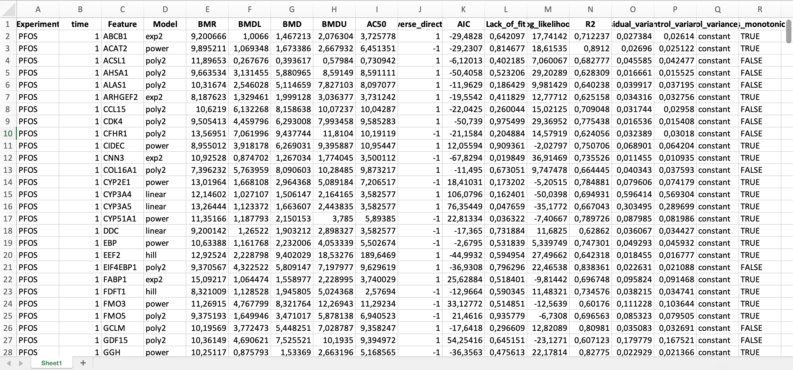
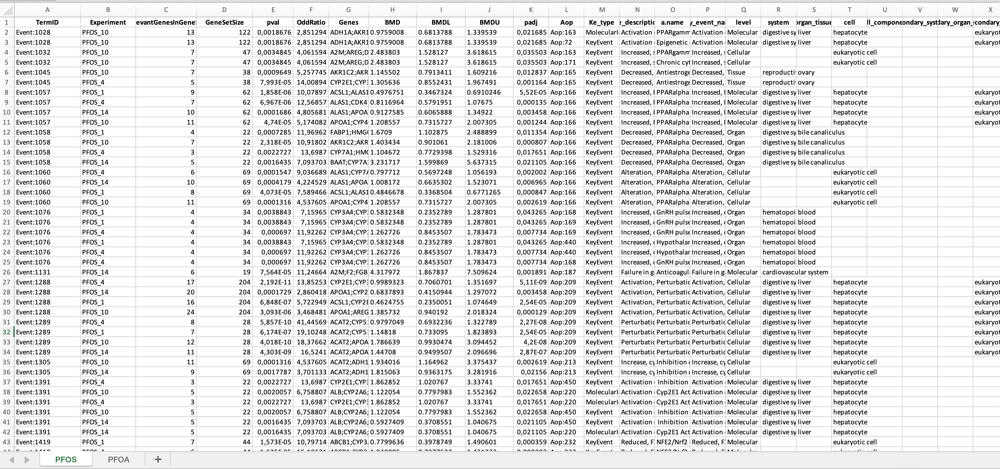
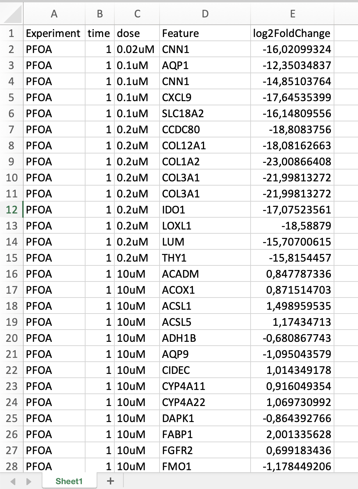

---
title: "Introduction"
output: html_document
---

TOTKA (Toxicogenomics and Toxicokinetics mapping to Adverse Outcome Pathways) is an R Shiny application designed to support **mechanistic and quantitative chemical risk assessment** by integrating multi-dose transcriptomic data with physiologically based kinetic (PBK) modelling within an Adverse Outcome Pathway (AOP) framework.

The framework links **molecular perturbations observed in vitro** with **internal exposure estimates and adverse outcomes**, enabling the derivation of human-relevant dose metrics and mechanistic interpretation of toxicity.

---

## Overview of the TOTKA Framework

## Required Inputs

TOTKA integrates multiple data sources derived from upstream analyses:

- Gene-level BMD results from dose-response modelling  

- KE enrichment results from dose dependent genes

- Optional differential expression data  

- KE enrichment derived from DEGs  

- Precomputed molecular docking data for Molecular Initiating Events (MIEs)

These inputs are combined to enable probabilistic estimation of KE activation and pathway-level interpretation.onalities

The application guides the user through the following workflow:

1. Import of toxicogenomics-derived inputs  
2. Visualization of gene- and KE-level data  
3. Simulation of internal exposure via forward dosimetry  
4. Probabilistic estimation of KE activation  
5. Integration into AOP networks  
6. Reverse dosimetry for exposure estimation  
``
