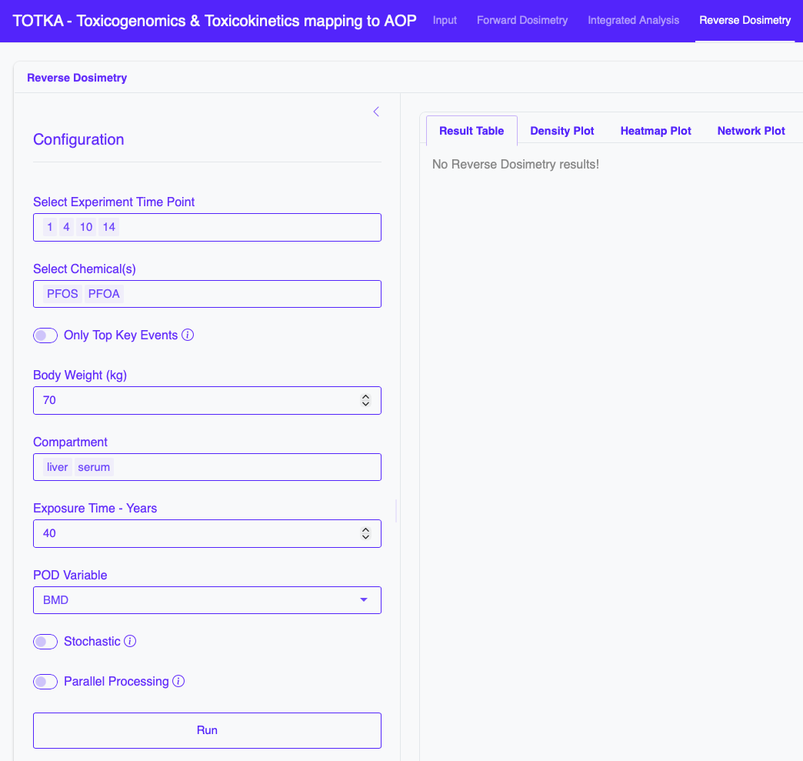
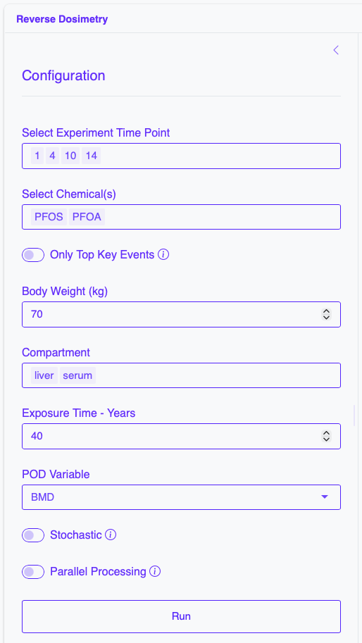
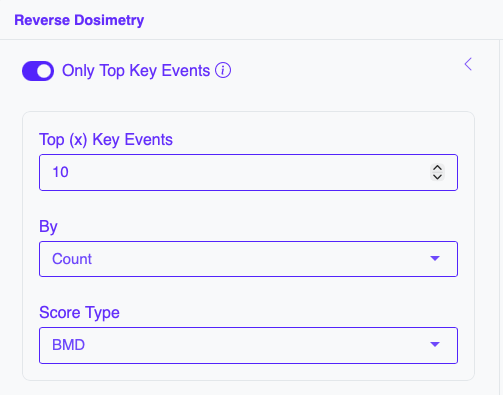
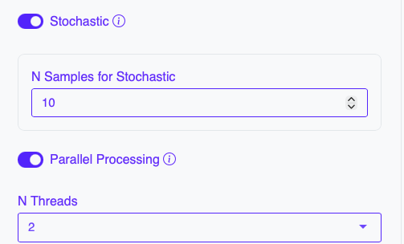
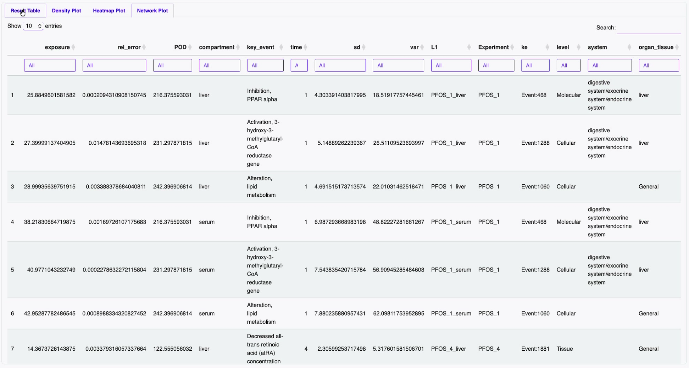
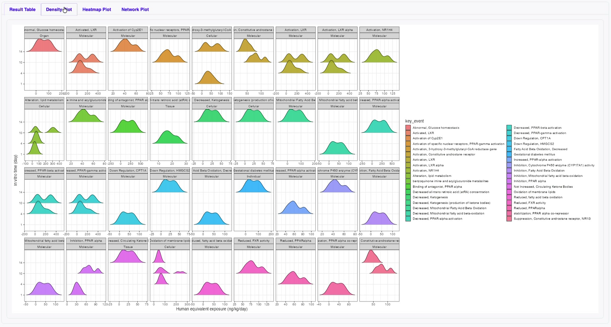
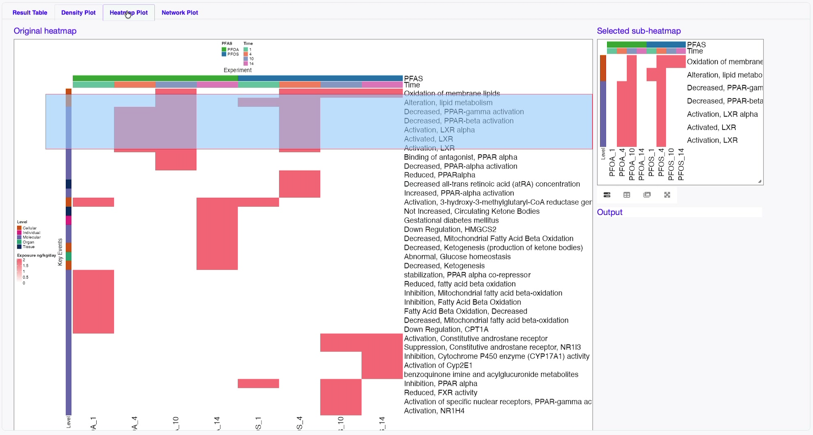
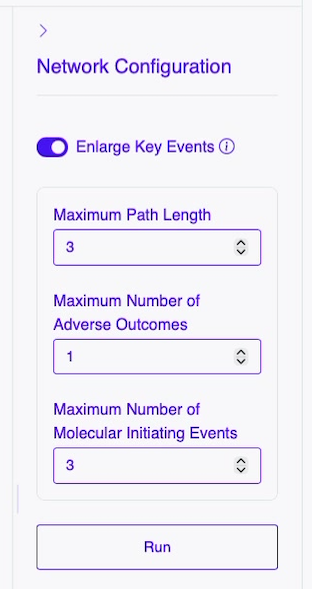
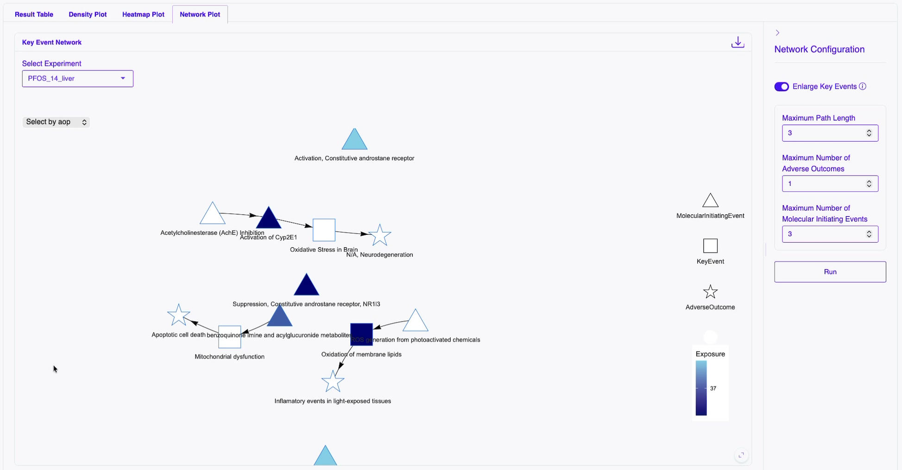
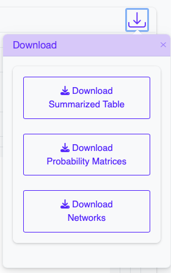

# Reverse Dosimetry

Estimates exposure from biological responses.

## Left Panel: Reverse Dosimetry Configuration

The left-hand side of the interface is dedicated to **configuration and running**.

### Parameters
- **Select Experiment Time Point** : Time point information uploaded in the BMD results input
- **Chemical** : chemical (PFOS, PFOA)
- **Body Weight (kg)** : body weight in kilograms
- **Compartment** : Compartments simuated during Forward Dosimetry analysis (PFOS, PFOA)
- **Exposure Time - Years** : Exposure time in years
- **POD variable** : Point of Departure score variable (BMDL, BMD, BMDU)
- **Only Top Key Event** (Optional) : Filter to select only top Key Events
  - **Top (x) Key Events** : How many top Key Events to select
  - **By** : Choose to select top Key Events by (Count, Percentage)
  - **Score Type** : Type of score to select top Key Events (BMDL, BMD, Adjusted P-Value)
    
  

- **Stochastic** : To use deterministic or stochastic process
  - **N Samples for Stochastic** :  Number of samples to use in Stochastic process
- **Parallel Processing** : To use parallel processing for computation
  - **N Threads** : Number of threads to use for parallel processing

  

## Right Panel: Reverse Dosimetry Analysis Results

### Output Tabs

- Results Table

- Density plots

- Heatmaps

- Key Event Network plot
  - Right Panel : Network configuration
    - Parameters:
      - **Enlarge Key Events** (optional) : Enlarge the KE-KE network using the path navigation from original nodes
        - **Maximum Path Length** : Maximum length of the path to extend
        - **Maximum Number of Adverse Outcomes**: Maximum number of Adverse Outcomes to include in the extension process
        - **Maximum Number of Molecular Initiating Events**: Maximum number of Molecular Initiating Events to include in the extension process

        

  - Left Panel : Network visualization

### Download Results

- Results Table : Download results table
- Summarized Results Table : Download summarized results table
- Network : Download the KE-KE networks

