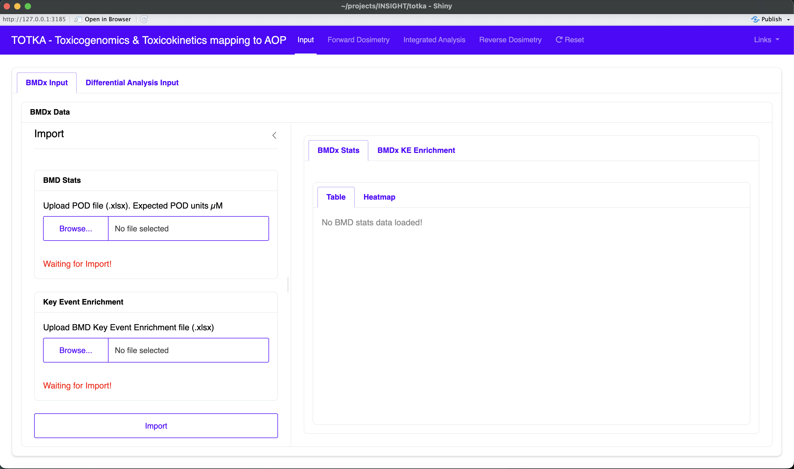
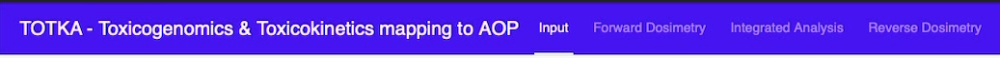

# Home page

When the application is launched, the following interface is displayed:

The home page represents the **entry point of the TOTKA workflow**, where users can import data and access all subsequent analysis modules.

---

## Overall Layout

The interface is organized into three main areas:

### Navigation bar (top)

At the top of the interface, a navigation bar provides access to all analysis steps:

- **Input**: Data import and preprocessing
- **Forward Dosimetry**: Simulation of internal concentrations
- **Integrated Analysis**: Probabilistic Key Event (KE) activation and pathway analysis
- **Reverse Dosimetry**: Estimation of human-equivalent doses (HEDs)
- **Reset**: Clear all loaded data and restart the workflow
- **Links**: Additional resources and references

This structure reflects the sequential workflow of TOTKA, moving from data ingestion to mechanistic interpretation and exposure estimation.

---

## Left Panel: Data Input Section

The left-hand side of the interface is dedicated to **data loading and configuration**.

### Input Tabs

Two input modes are available:

- **BMDx Input**
  - Used to upload dose-response modelling results (BMD) and KE enrichment derived from dose-dependent genes

- **Differential Analysis Input**
  - Used to upload differential expression datasets (DEGs) and corresponding KE enrichment results

---

